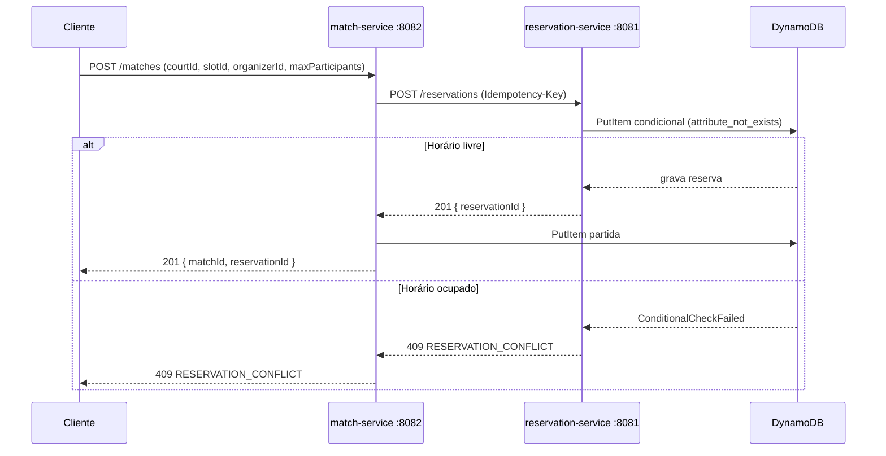

# JogaFácil — Plataforma Distribuída de Quadras e Partidas

JogaFácil é uma plataforma distribuída em nuvem (AWS) para gerenciamento de
espaços esportivos e formação de partidas. Este repositório é o monorepo dos
serviços e da infraestrutura.

O projeto também é o trabalho da disciplina de **Sistemas Distribuídos**. O
estado atual corresponde à **Entrega 2 — Primeiros Módulos e Comunicação**.

> Documento detalhado da entrega: [`docs/entrega-2.md`](docs/entrega-2.md)
>
> Comandos de subir/descer e controle de custo:
> [`docs/guia-operacao.md`](docs/guia-operacao.md) e `./scripts/aws-audit.sh`

---

## Estado atual (Entrega 2)

Dois serviços independentes comunicando-se por **REST** e implantados na AWS:

| Serviço | Porta | Responsabilidade |
|---|---|---|
| `reservation-service` | 8081 | Reserva e cancela horários de quadra com escrita condicional |
| `match-service` | 8082 | Cria partidas; reserva o horário via REST antes de persistir |

O fluxo demonstrado: ao criar uma partida, o `match-service` chama o
`reservation-service` para **segurar o horário**. Se o horário já estiver
reservado, a criação falha com **409 `RESERVATION_CONFLICT`** — nunca há dupla
reserva nem partida sem horário.

---

## Arquitetura

```mermaid
flowchart LR
    CLIENTE([Cliente / curl]) -->|HTTP| ALB[Application Load Balancer]
    ALB -->|/reservations*| RES[reservation-service :8081]
    ALB -->|/matches*| MATCH[match-service :8082]
    MATCH -->|"REST POST /reservations"| RES
    RES --> DDBR[(DynamoDB jogafacil-reservations)]
    RES --> DDBI[(DynamoDB jogafacil-idempotency)]
    MATCH --> DDBM[(DynamoDB jogafacil-matches)]
    MATCH -. descobre pelo nome .-> CM[AWS Cloud Map]
    CM -. reservation-service.jogafacil.local .-> RES
```

- **Local**: Docker Compose sobe o LocalStack (DynamoDB) e os dois serviços.
- **AWS**: ECS Fargate (um container por serviço) atrás de um ALB; descoberta de
  serviço pelo Cloud Map.

## Fluxo de comunicação



---

## Stack e justificativa

| Área | Tecnologia | Por quê |
|---|---|---|
| Linguagem | Java 21 (LTS) | Tipagem forte, threads virtuais, ecossistema maduro |
| Framework | Spring Boot 3.3 | Web/REST, validação, Actuator e injeção de dependência |
| Build | Maven multi-módulo | Reaproveita `common-contracts` entre os serviços |
| Persistência | Amazon DynamoDB (LocalStack local) | Escrita condicional é o mecanismo de coordenação |
| Comunicação | REST/JSON versionado | Comunicação síncrona simples e demonstrável |
| Containers | Docker + ECS Fargate | Serviços stateless, escaláveis sem gerenciar servidores |
| Entrada | Application Load Balancer | Roteamento por caminho para os dois serviços |
| Descoberta | AWS Cloud Map | Nomes lógicos, sem IP fixo |
| Observabilidade | Spring Boot Actuator + CloudWatch Logs | Health checks e logs de execução |

## Estrutura do repositório

```text
pom.xml                     # reator Maven (Spring Boot 3.3 / Java 21)
libs/common-contracts/      # ids ULID, modelo de erro RFC 9457, media type v1
services/
  reservation-service/      # reservas (8081)
  match-service/            # partidas (8082) + cliente REST do reservation
infra/
  docker/                   # Dockerfile e docker-compose (LocalStack + serviços)
  localstack/init/          # criação automática das tabelas DynamoDB
  terraform/                # ECS Fargate, ALB, Cloud Map, DynamoDB, IAM, logs
scripts/
  smoke.sh                  # teste ponta a ponta do fluxo de comunicação
  deploy.sh                 # build/push das imagens + terraform apply
specs/, docs/               # especificação, plano e documentação das entregas
```

---

## Como rodar localmente

Pré-requisitos: Docker + Docker Compose, `curl`, `python3`.

```bash
# 1. Sobe LocalStack + os dois serviços (cria as tabelas automaticamente)
docker compose -f infra/docker/docker-compose.yml up -d --build

# 2. Executa o teste ponta a ponta
./scripts/smoke.sh

# 3. Encerra
docker compose -f infra/docker/docker-compose.yml down -v
```

O `smoke.sh` valida: criação de partida com reserva do horário, conflito 409 no
mesmo horário, consulta da reserva, cancelamento e reutilização do horário.

## Como implantar na AWS

Pré-requisitos: AWS CLI configurada (`aws configure`), Docker e Terraform,
permissões de ECS/ECR/ALB/IAM/DynamoDB.

```bash
./scripts/deploy.sh          # ECR + build/push + terraform apply
# Ao final o script imprime a URL do ALB (alb_dns_name)
```

Exemplo de uso contra a nuvem:

```bash
ALB="http://$(terraform -chdir=infra/terraform output -raw alb_dns_name)"
curl -s -X POST "$ALB/matches" \
  -H 'Content-Type: application/vnd.jogafacil.v1+json' \
  -H 'Idempotency-Key: exemplo-1' \
  -d '{"courtId":"court_01ARZ3NDEKTSV4RRFFQ69G5FCC","slotId":"slot_01ARZ3NDEKTSV4RRFFQ69G5FDD","organizerId":"usr_01ARZ3NDEKTSV4RRFFQ69G5FAV","maxParticipants":10}'
```

**Para evitar custos**, destrua a infraestrutura quando não estiver usando:

```bash
terraform -chdir=infra/terraform destroy
```

## Endpoints

### reservation-service

| Método | Caminho | Descrição |
|---|---|---|
| POST | `/reservations` | Confirma reserva; requer `Idempotency-Key`; 201/200/409/422 |
| GET | `/reservations/{reservationId}` | Consulta a reserva |
| DELETE | `/reservations/{reservationId}` | Cancela (idempotente) e libera o horário |
| GET | `/actuator/health` | Health check |

### match-service

| Método | Caminho | Descrição |
|---|---|---|
| POST | `/matches` | Cria partida reservando o horário; 201/409/503 |
| GET | `/matches/{matchId}` | Consulta a partida |
| GET | `/actuator/health` | Health check |

Todos os endpoints aceitam/produzem `application/vnd.jogafacil.v1+json`
(fallback `application/json`). Erros seguem RFC 9457 (`problem+json`) com o
campo de domínio `code`.

---

## Testes

```bash
mvn verify        # testes unitários + integração (Testcontainers/LocalStack)
./scripts/smoke.sh
```

- **Unitários**: `common-contracts`, `ReservationService`, `MatchService`,
  `ReservationClient` (MockRestServiceServer).
- **Integração** (`*IT`, Testcontainers + LocalStack): repositórios DynamoDB,
  store de idempotência.

## Escopo e próximas entregas

**Nesta entrega (2):** comunicação REST entre dois serviços e implantação na
nuvem com os dois serviços em execução.

**Fora de escopo (Entregas 3 e 4):** mensageria assíncrona (SNS/SQS), relógio
lógico e ordenação de eventos, concorrência de vagas, replicação/consistência
(Aurora Multi-AZ), autenticação/autorização e segurança (WAF/KMS). O desenho
atual já deixa os contratos e identificadores prontos para essas etapas.
