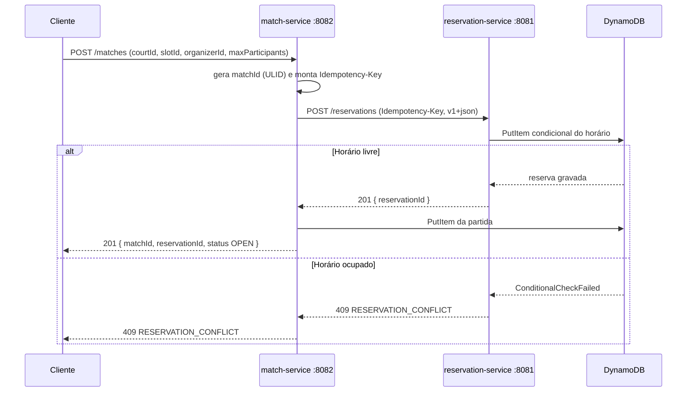

# Entrega 2 — Primeiros Módulos e Comunicação

**Disciplina:** Sistemas Distribuídos
**Integrantes:** Ana Carolina Fuentes · Samuel de Mello Cagnani
**Data:** 21/09/2026
**Tema:** JogaFácil — plataforma distribuída de quadras e partidas (AWS)

---

## 1. Objetivo da entrega

A Entrega 2 pede três itens:

1. **Implementação mínima de dois nós/serviços comunicando-se via RPC ou REST.**
2. **Configuração inicial em nuvem com pelo menos um serviço rodando.**
3. **Documentação de como a comunicação está implementada.**

Este documento descreve o que foi implementado, como os serviços se comunicam,
como foi implantado na AWS e as evidências obtidas.

---

## 2. Requisitos × implementação

| Requisito do professor | Como foi atendido |
|---|---|
| Dois serviços comunicando via RPC/REST | `match-service` chama `POST /reservations` do `reservation-service` por REST/JSON antes de criar a partida |
| Configuração inicial em nuvem com ≥ 1 serviço rodando | **Os dois** serviços rodando em **ECS Fargate** (us-east-1) atrás de um **Application Load Balancer**, acessíveis pela DNS do ALB |
| Documentação da comunicação | Este documento + `README.md`, com diagramas, contratos e evidências |

Além dos três itens, foi incluída a **coordenação por escrita condicional no
DynamoDB** para impedir dupla reserva do mesmo horário, pois é o núcleo do
domínio e já prepara as entregas seguintes.

---

## 3. Visão geral da arquitetura

```mermaid
flowchart LR
    CLIENTE([Cliente / curl]) -->|HTTP :80| ALB[Application Load Balancer]
    ALB -->|/reservations*| RES[reservation-service :8081]
    ALB -->|/matches*| MATCH[match-service :8082]
    MATCH -->|"REST POST /reservations"| RES
    RES --> DDBR[(DynamoDB reservations)]
    RES --> DDBI[(DynamoDB idempotency)]
    MATCH --> DDBM[(DynamoDB matches)]
    MATCH -. descobre pelo nome .-> CM[Cloud Map]
    CM -. reservation-service.jogafacil.local .-> RES
```

Cada serviço é um processo independente (container) e é dono dos seus dados.
O `match-service` **não acessa** o banco do `reservation-service`: a integração
ocorre somente por contrato REST.

---

## 4. Comunicação implementada (o item central da entrega)

### 4.1 Fluxo passo a passo



O ponto de comunicação é a chamada `match-service → reservation-service`. Ela é
**síncrona de propósito**: o resultado (reserva confirmada ou conflito) é
necessário para decidir se a partida pode existir. Uma partida nunca é criada
sem reserva de horário.

### 4.2 Detalhes do contrato REST

- **Método/caminho:** `POST /reservations` no `reservation-service`.
- **Media type versionado:** `application/vnd.jogafacil.v1+json`
  (o `application/json` também é aceito como fallback).
- **Cabeçalho `Idempotency-Key`:** identifica a operação. Repetir a mesma chave
  devolve o resultado já gravado (não cria reserva duplicada). Usar a mesma
  chave com corpo diferente retorna **422 `IDEMPOTENCY_KEY_REUSED`**.
- **Corpo da requisição:** `courtId`, `slotId`, `ownerId` (opcional nesta
  entrega), `matchId` (opcional).
- **Respostas:** `201` criada · `200` replay idempotente · `409`
  `RESERVATION_CONFLICT` · `422` chave reutilizada · `503` reserva indisponível.
- **Erros:** RFC 9457 (`application/problem+json`) com o campo de domínio
  `code`.

### 4.3 Por que a coordenação é necessária

Dois pedidos simultâneos para o mesmo `(courtId, slotId)` não podem ambos
confirmar. A garantia vem de uma **escrita condicional** no DynamoDB:

```
PutItem  condição: attribute_not_exists(courtId) OR status = CANCELLED
```

O DynamoDB avalia a condição de forma atômica para todos os escritores. Assim,
de N tentativas concorrentes, **no máximo uma** é confirmada; as demais recebem
`ConditionalCheckFailed`, traduzido para `409 RESERVATION_CONFLICT` (nunca 500).
Uma reserva cancelada (`CANCELLED`) não bloqueia o horário.

---

## 5. Serviços e endpoints

### reservation-service (:8081)

| Método | Caminho | Descrição |
|---|---|---|
| POST | `/reservations` | Confirma a reserva (requer `Idempotency-Key`) |
| GET | `/reservations/{reservationId}` | Consulta a reserva |
| DELETE | `/reservations/{reservationId}` | Cancela e libera o horário (idempotente) |
| GET | `/actuator/health` | Health check |

### match-service (:8082)

| Método | Caminho | Descrição |
|---|---|---|
| POST | `/matches` | Cria a partida reservando o horário |
| GET | `/matches/{matchId}` | Consulta a partida |
| GET | `/actuator/health` | Health check |

---

## 6. Modelo de dados (DynamoDB)

| Tabela | Chave | Observações |
|---|---|---|
| `jogafacil-reservations` | `courtId` (HASH) + `slotId` (RANGE) | GSI `byReservationId` para buscar pelo id |
| `jogafacil-matches` | `matchId` (HASH) | Guarda o `reservationId` associado |
| `jogafacil-idempotency` | `operationId` (HASH) | Atributo `ttl` de 24h |

---

## 7. Execução local

```bash
docker compose -f infra/docker/docker-compose.yml up -d --build
./scripts/smoke.sh
```

Saída obtida:

```text
== Aguardando servicos ==
  reservation-service pronto
  match-service pronto
== 1. POST /matches cria a partida e reserva o horario ==
  [OK]   cria partida (HTTP 201)
  reservationId=res_01M32CGZ3C17RY6CVXZ9BYSZ4N
== 2. Segundo POST /matches para o mesmo horario e rejeitado ==
  [OK]   conflito de horario (RESERVATION_CONFLICT) (HTTP 409)
  code=RESERVATION_CONFLICT
== 3. GET /reservations/{id} devolve a reserva ==
  [OK]   consulta reserva (HTTP 200)
== 4. DELETE /reservations/{id} cancela e libera o horario ==
  [OK]   cancela reserva (HTTP 200)
== 5. Novo POST /matches reutiliza o horario liberado ==
  [OK]   reutiliza horario liberado (HTTP 201)

Resultado: 5 OK, 0 FAIL
```

---

## 8. Implantação na AWS

### 8.1 Recursos provisionados (Terraform)

- **ECR**: repositórios das imagens dos dois serviços.
- **ECS Fargate**: cluster `jogafacil-cluster` com 1 task por serviço.
- **Application Load Balancer**: roteamento por caminho
  `/reservations*` → reservation-service e `/matches*` → match-service,
  com health check em `/actuator/health`.
- **AWS Cloud Map**: namespace privado `jogafacil.local`; o `match-service`
  acessa o `reservation-service` por `reservation-service.jogafacil.local:8081`
  (sem IP fixo).
- **DynamoDB**: as três tabelas da seção 6.
- **IAM**: execution role (ECR/logs) e task role (acesso ao DynamoDB).
- **CloudWatch Logs**: um log group por serviço.

### 8.2 Passos

```bash
aws configure                        # credenciais e regiao (us-east-1)
./scripts/deploy.sh                  # ECR + build/push + terraform apply
```

### 8.3 Evidência — serviços em execução

```text
aws ecs describe-services --cluster jogafacil-cluster \
  --services jogafacil-reservation-service jogafacil-match-service

+---------+----------+--------------------------------+----------+
| desired | running  |            service             |  status  |
+---------+----------+--------------------------------+----------+
|  1      |  1       |  jogafacil-reservation-service |  ACTIVE  |
|  1      |  1       |  jogafacil-match-service       |  ACTIVE  |
+---------+----------+--------------------------------+----------+
```

### 8.4 Evidência — fluxo ponta a ponta pela nuvem (via ALB)

```text
ALB = http://jogafacil-alb-2099265363.us-east-1.elb.amazonaws.com
SKIP_HEALTH_WAIT=1 RESERVATION_URL=$ALB MATCH_URL=$ALB ./scripts/smoke.sh

== 1. POST /matches cria a partida e reserva o horario ==
  [OK]   cria partida (HTTP 201)
  reservationId=res_01M32DBN0Y7R23MKKJGY9PMTQG
== 2. Segundo POST /matches para o mesmo horario e rejeitado ==
  [OK]   conflito de horario (RESERVATION_CONFLICT) (HTTP 409)
== 3. GET /reservations/{id} devolve a reserva ==
  [OK]   consulta reserva (HTTP 200)
== 4. DELETE /reservations/{id} cancela e libera o horario ==
  [OK]   cancela reserva (HTTP 200)
== 5. Novo POST /matches reutiliza o horario liberado ==
  [OK]   reutiliza horario liberado (HTTP 201)

Resultado: 5 OK, 0 FAIL
```

Resposta real de `POST /matches` já persistida no ambiente AWS:

```json
{
    "matchId": "match_01M32DCA47HYK55R2S7QA23Q49",
    "courtId": "court_01ARZ3NDEKTSV4RRFFQ69G5FCC",
    "slotId": "slot_01ARZ3NDEKTSV4RRFFQ69G5FDD",
    "organizerId": "usr_01ARZ3NDEKTSV4RRFFQ69G5FAV",
    "reservationId": "res_01M32DCA765JFPGSVSKS7ZM6ZA",
    "maxParticipants": 10,
    "participantCount": 0,
    "status": "OPEN",
    "createdAt": "2026-09-21T16:39:24.747413912Z"
}
```

> Observe que a partida guarda o `reservationId`: a reserva foi criada **pelo
> reservation-service** durante a chamada REST do match-service.

### 8.5 Evidência — dados persistidos e logs

```text
aws dynamodb scan --table-name jogafacil-reservations --select COUNT  ->  2
aws dynamodb scan --table-name jogafacil-matches      --select COUNT  ->  3

aws logs tail /ecs/jogafacil/reservation-service --since 1h
... Tomcat started on port 8081 (http) with context path '/'
... Started ReservationApplication in 49.206 seconds
```

---

## 9. Testes automatizados

Executar: `mvn verify` (usa Testcontainers para subir o DynamoDB via LocalStack).

| Módulo | Teste | O que verifica |
|---|---|---|
| common-contracts | `ResourceIdTest`, `UlidGeneratorTest` | Formato/unicidade dos identificadores |
| common-contracts | `ApiProblemsTest`, `GlobalExceptionHandlerTest` | Modelo de erro RFC 9457 |
| reservation-service | `ReservationServiceTest` | Idempotência (replay e 422) e conflito (409) |
| reservation-service | `ReservationRepositoryIT` | Uma reserva por `(courtId, slotId)`; liberação após cancelar |
| reservation-service | `DynamoDbIdempotencyStoreIT` | Claim/complete/release da chave de idempotência |
| match-service | `ReservationClientTest` | Método, header, media type e mapeamento de 409/5xx |
| match-service | `MatchServiceTest` | Reserva antes de persistir; 409 e 503 sem gravar partida |
| match-service | `MatchRepositoryIT` | Persistência da partida no DynamoDB |

O `./scripts/smoke.sh` complementa com um teste ponta a ponta do fluxo real.

---

## 10. Decisões de projeto e limitações conhecidas

- **`ownerId` opcional:** a autenticação entra na Entrega 4; por enquanto o
  `reservation-service` usa um dono padrão configurável quando o campo não é
  enviado. Está documentado no código e será substituído pelo usuário autenticado.
- **Idempotência da criação de partida:** o `Idempotency-Key` é propagado para a
  reserva, mas a criação da partida em si ainda não possui store de idempotência
  próprio. Esse controle está previsto para a Entrega 3, junto com os eventos.
- **Comunicação assíncrona (SNS/SQS), relógio lógico, concorrência de vagas,
  Aurora, segurança (WAF/KMS/JWT):** fora do escopo desta entrega.
- **HTTPS/TLS:** o ALB está em HTTP nesta entrega; TLS e WAF entram na
  Entrega 4.

---

## 11. Roteiro de demonstração (apresentação)

1. Mostrar o diagrama de arquitetura e os dois serviços.
2. Subir localmente (`docker compose up`) e rodar `./scripts/smoke.sh`,
   explicando cada passo (reserva, conflito, cancelamento, reuso).
3. Mostrar os itens persistidos no DynamoDB e o log da chamada REST.
4. Mostrar o ambiente AWS: ECS com as duas tasks `RUNNING` e o ALB.
5. Rodar o mesmo `smoke.sh` apontando para o ALB (nuvem).
6. Encerrar com `terraform destroy` para não gerar custo.

---

## 12. Custos e limpeza

Com uso enxuto, os componentes são: ALB (~US$16–20/mês, maior custo fixo),
2 tasks Fargate 0.25 vCPU/0.5 GB (~US$10–15/mês), DynamoDB on-demand e
CloudWatch Logs (praticamente zero). A VPC default evita NAT Gateway.

```bash
terraform -chdir=infra/terraform destroy   # remove tudo quando nao estiver em uso
```
